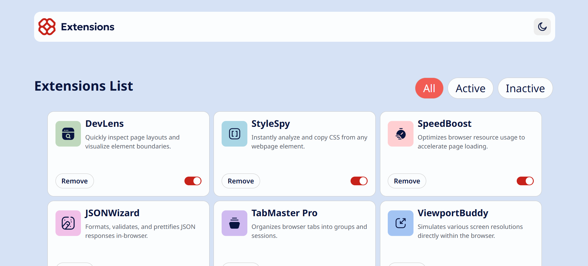
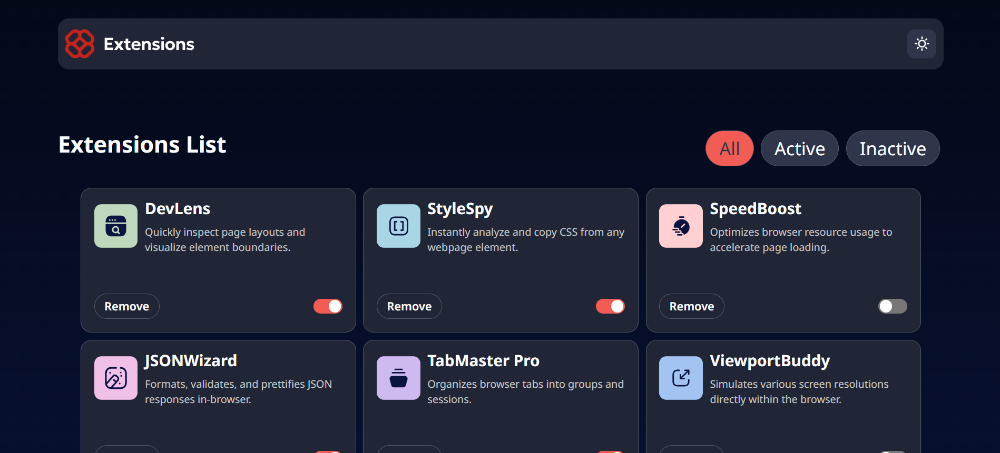

# Frontend Mentor - Browser extensions manager UI solution

Esta é a solução para o [Desafio "Browser extensions manager UI" do Frontend Mentor](https://www.frontendmentor.io/challenges/browser-extension-manager-ui-yNZnOfsMAp). 

## Tabela de Conteúdo

- [Visão geral](#visão-geral)
  - [O desafio](#o-desafio)
  - [Screenshot](#screenshot)
  - [Links](#links)
- [Meu processo](#meu-processo)
  - [Construído com](#construído-com)
- [Autor](#autor)

## Visão Geral

### O desafio

Tornar possível para o usuário:

- Alterar as extensões entre os estados Ativo e Inativo
- Filtrar as extensões ativas e inativas
- Remover extensões da lista
- Selecionar a cor do tema
- Vizualizar o layout da interface otimizada dependendo do tamanho de tela do usuário
- Ver os estados de hover e focus para todos os elementos interativos na tela

### Screenshot

### Links

- URL Solução: [https://github.com/EvandroBaraka/browser-extensions-manager-ui-main](https://github.com/EvandroBaraka/browser-extensions-manager-ui-main)
- URL Site: [https://evandrobaraka.github.io/browser-extensions-manager-ui-main/](https://evandrobaraka.github.io/browser-extensions-manager-ui-main/)

## Meu processo

### Construído com

- HTML5
- Propriedades CSS
- Flexbox
- [React](https://reactjs.org/) - JS library

## Autor

- Facebook - [Evandro Passaia](https://www.facebook.com/evandro.passaiaze)
- Frontend Mentor - [@EvandroBaraka](https://www.frontendmentor.io/profile/EvandroBaraka)
- Github - [@EvandroBaraka](https://github.com/EvandroBaraka)
- Linkedin - [Evandro Passaia](https://www.linkedin.com/in/evandro-passaia-62b9a5269/)